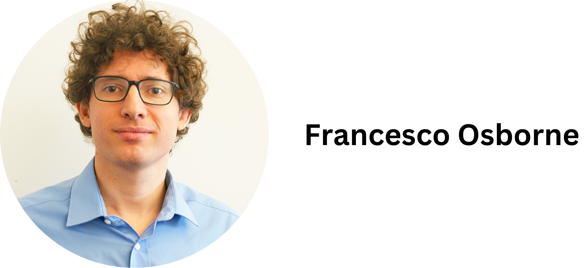

# Keynote speakers

Natalia is the CEO of [OpenAIRE](https://www.openaire.eu), a pan European e-Infrastructure supporting scholarly communication and open science Europe since 2009. She is also a research associate in “Athena” Research and Innovation Center and a co-founder in Opix, an AI-assisted policy & business analytics consultancy company. She holds a Physics degree from the University of Athens, and an MS in Electrical and Computing Engineering from the University of Wisconsin at Madison. She has several years of employment as a Software Engineer and Architect employed in the Bioinformatics commercial sector. She has expertise in Open Science policies and implementation, having served in the EOSC Executive Board (2018-20, chairing the Working Group on Skills and Training) and in the Open Science Policy Platform (2016-18), an EC High Level Advisory Group to provide advice about the development and implementation of open science policy in Europe. Her research interests include the topics of e-Infrastructures development and management, scientific data management, data curation and validation, research analytics. Natalia has also served in the EC Future Emerging Technology (FET) Advisory Group (2013-2017).

**Keynote Title:**

Leveraging NLP/ML to Transform Scholarly Communication: A New Horizon

**Keynote Abstract:**

The advent of Large Language Models (LLMs) has opened new horizons in the field of scholarly communication. This presentation aims to shed light on the transformative potential of combining LLMs with the Scientific Knowledge Graphs, to revolutionize the way scientific knowledge is created, shared, and utilized. On one hand, by processing and interpreting the intricate web of scientific literature, LLMs can automate the extraction of concepts, relationships, and trends, embedding them into knowledge graphs with unprecedented accuracy and depth. On the other, by using LLMs we may interpret user queries, expanding them to include synonyms and related terms for more comprehensive retrieval, and by implementing RAG models we may dynamically retrieve relevant information from the graphs in response to user queries. The presentation will explore practical applications of this integration in the context of the European Open Science Cloud and the OpenAIRE Graph, in improving the accessibility and discoverability of scientific information, thereby democratizing knowledge and fostering interdisciplinary collaboration. It will also address how Open Science principles act as a catalyst in the ethical considerations and bias mitigation towards an equitable access to information.

Francesco is a Senior Research Fellow at the Knowledge Media Institute, The Open University (UK), where he leads the [Scholarly Knowledge Mining team](http://skm.kmi.open.ac.uk). He authored more than 120 peer-reviewed publications in the fields of Artificial Intelligence, Information Extraction, Knowledge Graphs, Science of Science, and Research Analytics. His collaborations with leading international publishers have led to innovative intelligence solutions for the analysis of research literature. His work has been recognized with several awards, including the Best In-Use Paper Award at the International Semantic Web Conference 2022. He produced many resources for Open Science, including the [Computer Science Ontology](http://cso.kmi.open.ac.uk), the [CS Knowledge Graph](http://w3id.org/cskg), and the [AIDA Knowledge Graph](http://w3id.org/aida).

**Keynote Title:**

Integrating Large Language Models with Scientific Knowledge Graphs: Trends and Future Directions

**Keynote Abstract:**

The fast growth of Large Language Models has greatly improved our ability to answer questions based on extensive textual data, but it has also raised crucial concerns regarding the verification and reliability of the information these models provide. This is particularly important in scientific research, where the trustworthiness of information is critical. To tackle these challenges, one effective approach is to incorporate various scientific Knowledge Graphs developed by the research community. This can be done through different methods, including Retrieval-Augmented Generation (RAG), specific knowledge insertion techniques, or by training LLMs to query knowledge graphs. These solutions can improve the performance of Large Language Models across several key tasks, such as responding to scientific inquiries, assisting with literature reviews, extracting information from scholarly articles, generating new knowledge graphs, and formulating research hypotheses. In this talk, I will outline recent advancements in this field and discuss the open challenges. 
