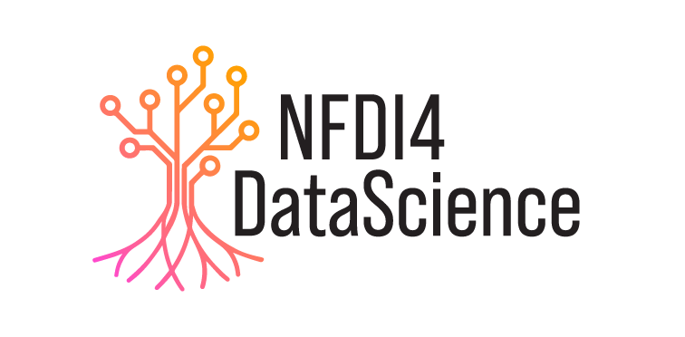

# Natural Scientific Language Processing and Research Knowledge Graphs (NSLP 2024)

<table>
  <tr>
    <td style="text-align:left">
      
    </td>
    <td>
    <strong>1st Workshop on Natural Scientific Language Processing and Research Knowledge Graphs (NSLP 2024)
</strong>
      
    <strong>Co-located with <a href="https://2024.eswc-conferences.org" target="_blank">ESWC</a></strong>
     
    <strong>May 26 or May 27 2024 (tbc)</strong>
     
    <strong>Hersonissos, Crete, Greece</strong>
    </td>
  </tr>
</table>

## Workshop Overview

Scientific research is almost exclusively published in unstructured text formats, which are not readily machine-readable. While technological approaches can help to get this flood of scientific information and new knowledge under control, the development of such technologies is very complex in practice and hinders the creation of infrastructures and systems to track research and assist the scientific community with applications such as dedicated scientific search engines and recommender systems. **The 1st Workshop on Natural Scientific Language Processing and Research Knowledge Graphs (NSLP)** aims to bring together researchers working on the processing, analysis, transformation and making-use-of scientific language and RKGs including all relevant sub-topics. NSLP 2024 is a full-day workshop co-located with [ESWC 2024](https://2024.eswc-conferences.org) to be held in Crete (Greece) in May 2024. The workshop will consist of two keynote speakers and two shared tasks, as well as presentations and posters of accepted papers. 

The workshop will offer **two shared tasks**:

* FoRC: Field of Research Classification of Scholarly Publications
* SOMD: Software Mention Detection in Scholarly Publications
  
More information on the shared tasks is available [on the shared tasks page](https://nfdi4ds.github.io/nslp2024/docs/shared_tasks.html).

## Important dates

* Paper submission deadline: **March 7, 2024**
* Notification of acceptance: **April 4, 2024**
* Camera-ready submission: **April 18, 2024**
* Workshop: **Either May 26 or May 27, 2024 (tbc)**
